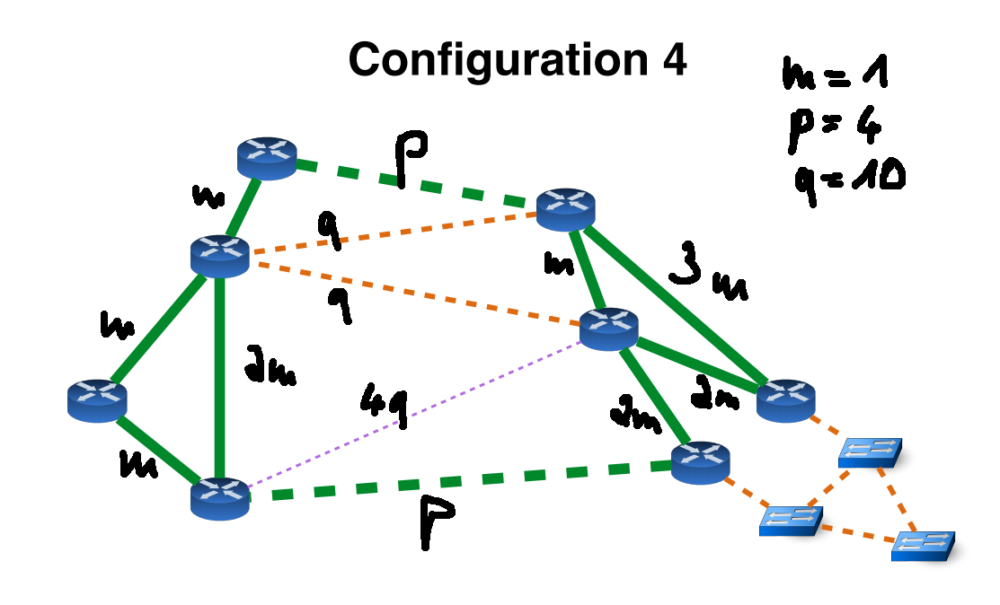

# 1.3: OSPF Cost adjusted to Network type 4
## Network topology and link weight


## Traceroute ATLA-host to ZURI-loopback

``` console
root@ATLA_host:~# traceroute 19.152.0.1
traceroute to 19.152.0.1 (19.152.0.1), 30 hops max, 60 byte packets
 1  ATLA-host.group19 (19.107.0.2)  0.513 ms  0.081 ms  0.026 ms
 2  MIAM-ATLA.group19 (19.0.13.2)  0.328 ms  0.351 ms NEWY-ATLA.group19 (19.0.11.1)  0.327 ms
 3  GENE-MIAM.group19 (19.0.9.1)  0.579 ms  0.541 ms BOST-NEWY.group19 (19.0.10.2)  0.455 ms
 4  PARI-LOND.group19 (19.0.4.1)  10.617 ms  10.628 ms LOND-BOST.group19 (19.0.7.1)  20.611 ms
 5  19.152.0.1 (19.152.0.1)  21.709 ms  21.673 ms  11.656 ms
```
We observe that traceroute with 3 packets sent explores two paths:  
1. ATLA -> NEWY -> BOST -> LOND -> PARI -> ZURI
2. ATLA -> MIAM -> GENE -> PARI -> ZURI

At least we think that we observe these routes. We can't be totally sure since we are missing some feedback, for instance GENE->PARI or PARI->ZURI. There should also be a third route, deviating from the first route in using the connection LOND->ZURI instead of LOND->PARI->ZURI, which is present in a `traceroute` from *LOND-host* to *ZURI-loopback*.  

We see these two routes because they have the same weight in total. Traffic from *MIAM* to *ZURI* is balanced to cost 9. The third possible route mentioned above also has the cost of 9.