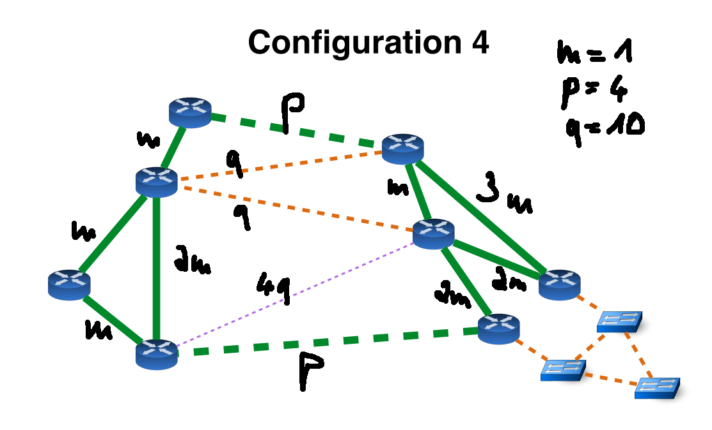

<h1 id=""></h1>
# FU Telematics 20/21 Project 2 - Mini Internet
## Group 19
## by Corin Baurmann, Karl Skomski, Justus Purat, Matthias Kind

> This PDF is generated from multiple Markdown files. The seperate files, as wall as additional information, can be found at [https://github.com/lokmeinmatz/telematik2020_inet](https://github.com/lokmeinmatz/telematik2020_inet)

## Contents


### 1 - Internal Networking
- [1.1: VLAN and Swiss network](#1.1)
- [1.2: OSPF basics](#1.2)
- [1.3: OSPF Cost adjusted to Network type 4](#1.3)
- [1.4: No transit through swiss local](#1.4)
- [1.5: iBGP](#1.5)

### 2 - eBGP
- [2.1: eBGP](#2.1)
- [2.2: IXP Peering](#2.2)

### 3 - Policies
- [3.1: Business relationships](#3.1)
- [3.2 IXP policy](#3.2)
- [3.5: BGP Hijack](#3.5)


<h1 id="1.1"></h1>
# 1.1: VLAN and Swiss network

## Hosts
Hosts are given an IP address and a standard gateway. Students and Staff are in different subnets. The `/23` subnet gets split up into two `/24` subnets.
Hosts at switches *CERN* and *EPFL* use Router *GENE* as Router and Gateway, hosts at switch *EHTZ* use Router *ZURI*.

| Hostname | IP | 
| --- | ----------- | 
| staff_x | 19.200.0.x/24 | 
| student_x | 19.200.0.x/24 |

## Switches
Switches are configured to tag ports connected to staff with `VLAN 10`, ports with students with `VLAN 20`. Trunks exist between switches and from switches to routers.

## Routers
Routers are assigned two IP addresses each, one per virtual interface, that is, one per interface per VLAN. As they are connected via trunk with the switches, the incomming trafic gets split up onto `{ROUTERname}-L2.10` and `{ROUTERname}-L2`.20. Corresponding to the VLANs and different subnets, `L2.10` interfaces are assigned an IP in the `19.200.0.0/24` subnet and `L2.20` are in the `19.200.1.0/24` subnet.

| Router | VLAN | IP |
| --- | ----------- | ---|
| GENE | 10 | 19.200.0.100/24 |
| | 20 | 19.200.1.100/24 |
| ZURI | 10 | 19.200.0.200/24 |
| | 20 | 19.200.1.200/24 |

## Reports on traceroutes

### Traceroute EPFL-student to EPFL-staff
```console
root@student_3:~# traceroute 19.200.0.3
traceroute to 19.200.0.3 (19.200.0.3), 30 hops max, 60 byte packets
 1  19.200.1.100 (19.200.1.100)  8.787 ms  8.309 ms  8.219 ms
 2  19.200.0.3 (19.200.0.3)  12.334 ms  11.103 ms  11.451 ms
```
### Traceroute ETHZ-staff to EPFL-student
```console
root@staff_2:~# traceroute 19.200.1.3
traceroute to 19.200.1.3 (19.200.1.3), 30 hops max, 60 byte packets
 1  19.200.0.200 (19.200.0.200)  4.062 ms  3.402 ms  3.400 ms
 2  19.200.1.3 (19.200.1.3)  13.809 ms  13.799 ms  13.832 ms
```
### Traceroute EPFL-student to ETHZ-staff
```console
root@student_3:~# traceroute 19.200.0.2
traceroute to 19.200.0.2 (19.200.0.2), 30 hops max, 60 byte packets
 1  19.200.1.100 (19.200.1.100)  6.800 ms  6.189 ms  6.093 ms
 2  19.200.0.2 (19.200.0.2)  14.132 ms  13.984 ms  14.051 ms
```

Since every traceroute is between subnets and respective VLANs, that is between staff's `VLAN 10` and subnet `19.200.0.0/24` and student's `VLAN 20` and subnet `19.200.1.0/24`, the respective host uses it's standard gateway as configured above to send the packet to the router. The router then sends the packet to over the corresponding interface to the recipient.


<h1 id="1.2"></h1>
# 1.2: OSPF basics
fully configured example router is MIAM (8)

all frrouting commands can get shortened till unique, like `sho interf br` for `show interface brief` 

`exit` moves you one layer back

each router (except GENE and ZURI) has an associated host device, you can access via `./goto.sh <ROUTER_NAME> host`

## per router with id Y and name <ROUTER_NAME>

check which interfaces are allready configured with `show interface brief`

## configure loopback

interface name `lo`
router Y needs lo address 19.[150+Y].0.1/24

To set this:
* `conf t` (goes into config mode)
* `interface lo`
* `ip address <LOOPBACK_ADDRESS>/24`

To test:
`ping <LOOPBACK_ADDRESS>` should work

## configure router interfaces

For addresses see netmap.png
Process same as for loopback, interface names are `port_<CONNECTED_ROUTER>`


## configure host connection

* `conf t`
* `interface host`
* `ip address 19.[100+Y].0.2/24`

* go back to AS root, then `./goto.sh <ROUTER_NAME> host`
* `ip address add 19.[100+Y].0.1/24 dev <ROUTER_NAME>router`
ping between host and rotuer should work


# Configure OSPF

enable ospf with
* `router ospf`
* `network 19.0.0.0/24 area 0` for inter-router-ospf
* `network 19.10x.0.0/24 area 0` for host ospf


To check if ospf is working, wait a few seconds and type `show ip route ospf`
There you can check which entries came from other routers and via which port the packet is routed

each host also needs a default route configured, where to send all packets that don't belong in the subnet between host and router.
Set with `ip route add default via 19.10x.0.2`


# Result
``` console
root@PARI_host:~# traceroute ATLA-host.group19
traceroute to ATLA-host.group19 (19.107.0.2), 30 hops max, 60 byte packets
 1  PARI-host.group19 (19.103.0.2)  0.162 ms  0.055 ms  0.053 ms
 2  NEWY-PARI.group19 (19.0.5.2)  2.216 ms MIAM-PARI.group19 (19.0.6.2)  0.285 ms NEWY-PARI.group19 (19.0.5.2)  2.114 ms 
 3  ATLA-host.group19 (19.107.0.2)  2.461 ms  0.570 ms  2.472 ms
root@PARI_host:~#
```

Here a traceroute and DNS lookup work, the packet gets send

PARI-host -> PARI-router -> NEWY-router -> ATLA-router -> ATLA-host

<h1 id="1.3"></h1>

# 1.3: OSPF Cost adjusted to Network type 4
## Network topology and link weight


## Traceroute ATLA-host to ZURI-loopback

``` console
root@ATLA_host:~# traceroute 19.152.0.1
traceroute to 19.152.0.1 (19.152.0.1), 30 hops max, 60 byte packets
 1  ATLA-host.group19 (19.107.0.2)  0.513 ms  0.081 ms  0.026 ms
 2  MIAM-ATLA.group19 (19.0.13.2)  0.328 ms  0.351 ms NEWY-ATLA.group19 (19.0.11.1)  0.327 ms
 3  GENE-MIAM.group19 (19.0.9.1)  0.579 ms  0.541 ms BOST-NEWY.group19 (19.0.10.2)  0.455 ms
 4  PARI-LOND.group19 (19.0.4.1)  10.617 ms  10.628 ms LOND-BOST.group19 (19.0.7.1)  20.611 ms
 5  19.152.0.1 (19.152.0.1)  21.709 ms  21.673 ms  11.656 ms
```
We observe that traceroute with 3 packets sent explores two paths:  
1. ATLA -> NEWY -> BOST -> LOND -> PARI -> ZURI
2. ATLA -> MIAM -> GENE -> PARI -> ZURI

At least we think that we observe these routes. We can't be totally sure since we are missing some feedback, for instance GENE->PARI or PARI->ZURI. There should also be a third route, deviating from the first route in using the connection LOND->ZURI instead of LOND->PARI->ZURI, which is present in a `traceroute` from *LOND-host* to *ZURI-loopback*.  

We see these two routes because they have the same weight in total. Traffic from *MIAM* to *ZURI* is balanced to cost 9. The third possible route mentioned above also has the cost of 9.

<h1 id="1.4"></h1>
# 1.4: No transit through swiss local
## Technique
We stopped routing through the swiss local network by not changing the default weights of the links of the two routers *GENE* and *ZURI* into the swiss local network. The default weight has the value of **10**, where as the route between *ZURI* and *GENE* traversing *PARI* has a weight of **4** in our network cost configuration explained in [1.3 Ospf cost](#1.3).  

The routing of all packets from *ZURI* to *PARI-host* over *GENE* explicitly is guaranteed by a static route at *ZURI*, routing pakets addressed to *PARI-host* to the Interface of *GENE* within the swiss local network `VLAN 10` with IP address `19.200.0.100`.  
Another static route at *GENE* forwards then forwards these pakets to *PARI*, although this second static route shouldn't be necessary anymore because it is the shortest route in OSPF routing anyways.

## Traceroute from *staff_2* to *PARI-host*
```console
root@staff_2:~# traceroute 19.103.0.1
traceroute to 19.103.0.1 (19.103.0.1), 30 hops max, 60 byte packets
1  19.200.0.200 (19.200.0.200)  5.594 ms  4.769 ms  4.787 ms
2  19.200.0.100 (19.200.0.100)  8.212 ms  8.192 ms  8.123 ms
3  PARI-GENE.group19 (19.0.3.1)  7.994 ms PARI-ZURI.group19 (19.0.1.2)  7.413 ms PARI-GENE.group19 (19.0.3.1)  8.192 ms
4  host-PARI.group19 (19.103.0.1)  7.900 ms  7.880 ms  8.159 ms
```
Note: In line three a paket is received on the interface of *ZURI* directly connected to *PARI*. This is not because a paket was sent directly to *PARI* from *ZURI*, but because the cost of the route from *PARI* to *ZURI* directly is the same as the detour via *GENE*. Therefore the timeout ICMP packages get loadbalanced and one is sent directly.


<h1 id="1.5"></h1>
# 1.5: iBGP

Each router was fed the following commands under `route bgp 19`:

```
neighbor 19.157.0.1 remote-as 19
neighbor 19.157.0.1 update-source lo
neighbor 19.157.0.1 next-hop-self
```


## BGP summary of ATLA:
``` console
ATLA_router# sho ip bg sum

IPv4 Unicast Summary:
BGP router identifier 19.157.0.1, local AS number 19 vrf-id 0
BGP table version 0
RIB entries 0, using 0 bytes of memory
Peers 7, using 143 KiB of memory

Neighbor        V         AS MsgRcvd MsgSent   TblVer  InQ OutQ  Up/Down State/PfxRcd
19.151.0.1      4         19      85      83        0    0    0 01:06:17            0
19.152.0.1      4         19      68      74        0    0    0 01:05:59            0
19.153.0.1      4         19      67      74        0    0    0 01:04:28            0
19.154.0.1      4         19      67      74        0    0    0 01:04:01            0
19.155.0.1      4         19      66      72        0    0    0 01:03:31            0
19.156.0.1      4         19      66      74        0    0    0 01:03:08            0
19.158.0.1      4         19      11      11        0    0    0 00:08:18            0

Total number of neighbors 7
```

## Necessity of update-source 
The command `update-source` needs to be used because the BGP-Session is established via the IP bound to the interface specified in the routing table as outgoing for the IP address of the partner. A temporary or permanent defect of this interface would tear down the connection, even though the router itself might still be online via one of the other interfaces. The command `update-source` allows binding the session to the IP and corresponding loopback interface, which will always be reachable as long as there is still a connection to the network.

<h1 id="2.1"></h1>
# 2.1: eBGP
## Function of `next-hop-self`
Since routing within the AS between routers belonging to the same AS shouldn't be determined by BGP, routers within the AS shouldn't add themselves to the respective paths when propagating routing information through the network.  
Because of that, the routers bordering a different AS don't add themselves onto the path provided by external routers when forwarding the info to their interal BGP partners. This is problematic because now these routers are missing the address of the router able to reach the advertised AS. Therefore, routers bordering a different AS need to set themselves as the next hop when forwarding the information to iBGP partners. This ensures that these partners know how to reach the targets known to the border router.

## PARI bgp table (shortened report)
``` console
PARI_router# sho ip bgp
[...]
   Network          Next Hop            Metric LocPrf Weight Path
*> 1.0.0.0/8        179.0.92.1                             0 20 1 i
* i                 19.152.0.1                    100      0 18 1 i
* i                 19.157.0.1                    100      0 22 1 i
*>i2.0.0.0/8        19.155.0.1               0    100      0 2 i
*  3.0.0.0/8        179.0.92.1                             0 20 1 3 i
*>i                 19.155.0.1                    100      0 2 3 i
[...]
*>i18.0.0.0/8       19.152.0.1               0    100      0 18 i
*                   179.0.92.1                             0 20 18 i
* i19.0.0.0/8       19.155.0.1               0    100      0 i
*>i                 19.152.0.1               0    100      0 i
*> 20.0.0.0/8       179.0.92.1               0             0 20 i
* i21.0.0.0/8       19.158.0.1               0    100      0 21 i
*>i                 19.154.0.1               0    100      0 21 i
*>i22.0.0.0/8       19.157.0.1               0    100      0 22 i
``` 

## Looking Glass from AS 20 (router: LOND)
``` console
2021-02-18T17:54:19
...

   Network          Next Hop            Metric LocPrf Weight Path
...
*>i19.0.0.0/8       20.153.0.1                    100      0 19 i
...
Displayed  34 routes and 57 total paths
```

## Traceroute to PARI host from AS 20
``` console
root@PARI_host:~# traceroute 20.153.0.1
traceroute to 20.153.0.1 (20.153.0.1), 30 hops max, 60 byte packets
 1  PARI-host.group19 (19.103.0.2)  0.537 ms  0.119 ms  0.062 ms
 2  20.153.0.1 (20.153.0.1)  2.172 ms  2.160 ms  2.126 ms
```

<h1 id="2.2"></h1>
# 2.2: IXP Peering

### Community Lists
``` console
NEWY_router# show bgp community-list
[...]
Community standard list 10
    permit 19:17
    permit 19:18
Community standard list 20
    permit 19:21
    permit 19:22
```
These community lists allow us to apply match expressions fitting either community-list 10, which are our providers, or community-list 20, which are our customers. We tag incoming routes by those partners on entry into our AS.

### Prefix-List
``` console
NEWY_router# show ip prefix-list
[...]
BGP: ip prefix-list our_prefix: 1 entries
   seq 5 permit 19.0.0.0/8
```
This prefix-list allows us to match our own prefix.

### Route-Map `ATTACH_COMM_VALS`
``` console
NEWY_router# show route-map
[...]
BGP:
route-map: ATTACH_COMM_VALS Invoked: 2291
 permit, sequence 10 Invoked 2291
  Match clauses:
    community 20
  Set clauses:
    community 82:2 82:4 82:6 82:8 82:10 82:12 82:14 82:15 82:17
[...]
 permit, sequence 11 Invoked 1592
  Match clauses:
    ip address prefix-list our_prefix
  Set clauses:
    community 82:2 82:4 82:6 82:8 82:10 82:12 82:14 82:15 82:17
[...]
 deny, sequence 12 Invoked 38
  Match clauses:
    community 10
  Set clauses:
[...]
 permit, sequence 13 Invoked 34
  Match clauses:
  Set clauses:
    community 82:2 82:4 82:6 82:8 82:10 82:12 82:14 82:15
[...]
```
The route-map `ATTACH_COMM_VALS` has three route entries. The first checks for routes being sent to us by our customers AS21 and AS22 via the community-list `20`. The second checks for our own prefix. Both of those route entries add community values advertising to all peers connected to the IXP.  
The third entry advertises all other prefixes and routes to all participants except to our Provider AS17. This prevents us from being used as a transit network to our provider for prefixes not associated with us or our customers.

>Info: These filtering steps become obsolete in light of new information provided in the requirements for the record for task 3.1 and the requirements of task 3.2. We highlight this change of our understanding in [3.1: Business Relations](#3.1).

### Looking Glass Entry AS6
``` console
2021-02-18T19:44:37
BGP table version is 4458187, local router ID is 6.155.0.2, vrf id 0
Default local pref 100, local AS 6
Status codes:  s suppressed, d damped, h history, * valid, > best, = multipath,
               i internal, r RIB-failure, S Stale, R Removed
Nexthop codes: @NNN nexthop's vrf id, < announce-nh-self
Origin codes:  i - IGP, e - EGP, ? - incomplete

   Network          Next Hop            Metric LocPrf Weight Path
   [...]
*> 19.0.0.0/8       180.82.0.19              0             0 19 i
   [...]
```

### Measurement Container Output from AS6
``` console 
root@d84c6ab09884:~# ./launch_traceroute.sh 6 19.155.0.1
Hop 1:  6.0.199.1 TTL=0 during transit
Hop 2:  6.0.4.2 TTL=0 during transit
Hop 3:  6.0.8.2 TTL=0 during transit
Hop 4:  19.155.0.1 Echo reply (type=0/code=0)
Hop 5:  19.155.0.1 Echo reply (type=0/code=0)
```

<h1 id="3.1"></h1>
# 3.1: Business relationships

### Example of route-maps
We tagged the incoming bgp routes on all customer / provider routers with the AS they came from with the schema 19:\<AS-Nr>

For example from `sh run` on LOND router (conn. to provider 1 / AS 17):
``` console
route-map TAG_17 permit 10
    set community 19:17
```

route-map TAG_17 tags all incoming routes from AS 17 with 19:17 to filter them for the IXP eBGP connections.

<br>

``` console
bgp community-list 20 permit 19:21
bgp community-list 20 permit 19:22
```

creates a community list nr. 20, which matches on the tags from AS 21 and 22

<br>

``` console
route-map PROVIDER_FILTER permit 10
 match community 20
 set community none
...
ip prefix-list our_prefix seq 5 permit 19.0.0.0/8
...
route-map PROVIDER_FILTER permit 11
 match ip address prefix-list our_prefix
```

creates the route-map `PROVIDER_FILTER`, which only permits bgp routes to the provider, which either came from  community list 20 (AS 21 / 22 aka. our customers) or our own 19.0.0.0/8 prefix and also clears our internal community tags.
    
<br>

``` console
router bgp 19
    neighbor 179.0.91.1 route-map TAG_17 in
    neighbor 179.0.91.1 route-map PROVIDER_FILTER out
```
activates the two route-maps for in and out on the interface towards AS 17.

## Intermezzo
> Up until this point, we considered the requirements to configure our advertisements according to the customer/provider relationships without the additional information of what was expected in the report of 3.1 and the following requirements of task 3.2, namely that peers should **only** now about our and our customers prefix (3.1 report info) and that we should not peer with IXP participants in our region (3.2 requirements).  
>
>We will therefore from this point on revise the route-maps provided and explained in [2.2: IXP Peering](../2/ixp_community_vals.md) to adhere to the new (or better: newly evident) requirements.

### Peering
At NEWY facing the IXP82 and PARI facing our PEER AS20 we made sure to only export our routes and those of our customers with the community and prefix lists outlined above and to only accept routes incoming from the other region. The latter we achieved by creating a route-map matching an as-path with regex and denying routes going to AS's 15,17,21,23, and 25.

### Looking Glass of Peer AS20
``` console
2021-02-18T20:38:39
   Network          Next Hop            Metric LocPrf Weight Path
*>i1.0.0.0/8        20.155.0.1               0    100      0 1 i
*>i2.0.0.0/8        20.155.0.1                    100      0 1 3 2 i
*>i3.0.0.0/8        20.155.0.1                    100      0 1 3 i
*>i5.0.0.0/8        20.155.0.1               0    100      0 5 i
*>i6.0.0.0/8        20.155.0.1                    100      0 1 3 2 8 6 i
*>i7.0.0.0/8        20.155.0.1               0    100      0 7 i
*>i8.0.0.0/8        20.155.0.1                    100      0 1 3 2 8 i
*>i9.0.0.0/8        20.155.0.1               0    100      0 9 i
*>i10.0.0.0/8       20.155.0.1                    100      0 7 10 i
*>i11.0.0.0/8       20.155.0.1               0    100      0 11 i
*>i12.0.0.0/8       20.155.0.1                    100      0 7 9 12 i
*>i13.0.0.0/8       20.155.0.1               0    100      0 13 i
*>i14.0.0.0/8       20.155.0.1                    100      0 11 14 i
*>i16.0.0.0/8       20.155.0.1                    100      0 7 16 i
*>i17.0.0.0/8       20.152.0.1               0    100      0 17 i
* i18.0.0.0/8       20.156.0.1               0    100      0 18 i
*>i                 20.151.0.1               0    100      0 18 i
*> 19.0.0.0/8       179.0.92.2                             0 19 i
* i20.0.0.0/8       20.155.0.1               0    100      0 i
* i                 20.157.0.1               0    100      0 i
* i                 20.158.0.1               0    100      0 i
* i                 20.154.0.1               0    100      0 i
* i                 20.151.0.1               0    100      0 i
* i                 20.156.0.1               0    100      0 i
*>                  0.0.0.0                  0         32768 i
* i                 20.152.0.1               0    100      0 i
*> 21.0.0.0/8       179.0.92.2                             0 19 21 i
* i22.0.0.0/8       20.155.0.1                    100      0 7 22 i
*>                  179.0.92.2                             0 19 22 i
* i23.0.0.0/8       20.155.0.1                    100      0 7 22 23 i
*>                  179.0.92.2                             0 19 21 23 i
*>i24.0.0.0/8       20.155.0.1                    100      0 7 24 i
*                   179.0.92.2                             0 19 21 24 i
*>i25.0.0.0/8       20.155.0.1                    100      0 7 24 25 i
*>i26.0.0.0/8       20.155.0.1                    100      0 7 26 i
[...]
```

### Measurement Traceroute from Customer AS22 to Peer AS6
``` console
root@d84c6ab09884:~# ./launch_traceroute.sh 22 6.155.0.1
Hop 1:  22.0.199.1 TTL=0 during transit
Hop 2:  179.0.96.1 TTL=0 during transit
Hop 3:  19.0.11.1 TTL=0 during transit
Hop 4:  6.155.0.1 Echo reply (type=0/code=0)
Hop 5:  6.155.0.1 Echo reply (type=0/code=0)
```

<h1 id="3.2"></h1>
# 3.2 IXP policy

``` console
NEWY_router# sho route-map
[...]
BGP:
route-map: ATTACH_COMM_VALS Invoked: 2447
 permit, sequence 10 Invoked 2447
  Match clauses:
    community 20
  Set clauses:
    community 82:2 82:4 82:6 82:8 82:10 82:12 82:14
  Call clause:
  Action:
    Exit routemap
 permit, sequence 11 Invoked 1718
  Match clauses:
    ip address prefix-list our_prefix
  Set clauses:
    community 82:2 82:4 82:6 82:8 82:10 82:12 82:14
  Call clause:
  Action:
    Exit routemap
[...]
route-map: PERMIT_OTHER_REGION Invoked: 126
 permit, sequence 10 Invoked 126
  Match clauses:
    as-path only_our_region
  Set clauses:
    community none
  Call clause:
  Action:
    Exit routemap
```
ATTACH_COMM_VALS is the outgoing route-map that sets the IXP community values, so that the other region gets our advertisements. We only allow `community 20` (our customers) and `prefix-list our_prefix` (our /8 advertisement).
This way, we prevent beeing a transfer AS for our peer and our providers, which would add additional costs.

PERMIT_OTHER_REGION is ingoing route-map, which denies all ASes on our side if the IXP. (the name of the as-path access list `only_our_region` is missleading, as it denies AS 15|17|21|23|25)

``` console
NEWY_router# sho ip bgp

   Network          Next Hop            Metric LocPrf Weight Path
* i1.0.0.0/8        19.153.0.1                    100      0 20 1 i
* i                 19.152.0.1                    100      0 18 1 i
*                   180.82.0.2                             0 2 3 1 i
*>i                 19.157.0.1                    100      0 22 1 i
*> 2.0.0.0/8        180.82.0.2               0             0 2 i
* i3.0.0.0/8        19.153.0.1                    100      0 20 3 i
* i                 19.152.0.1                    100      0 18 3 i
*>                  180.82.0.2                             0 2 3 i
* i5.0.0.0/8        19.153.0.1                    100      0 20 5 i
* i                 19.152.0.1                    100      0 18 5 i
*>                  180.82.0.6                             0 6 5 i
[..]
*> 12.0.0.0/8       180.82.0.8                             0 8 9 12 i
*  13.0.0.0/8       180.82.0.2                             0 2 3 20 13 i
* i                 19.153.0.1                    100      0 20 13 i
* i                 19.152.0.1                    100      0 18 13 i
*>i                 19.157.0.1                    100      0 22 13 i
[..]
* i26.0.0.0/8       19.153.0.1                    100      0 20 7 26 i
* i                 19.152.0.1                    100      0 18 7 26 i
*>                  180.82.0.8                             0 8 23 26 i
* i                 19.158.0.1                    100      0 21 24 26 i
* i                 19.154.0.1                    100      0 21 23 26 i
* i                 19.157.0.1                    100      0 22 24 26 i
* i176.0.0.0/4      19.153.0.1                    100      0 20 18 17 i
*>                  180.82.0.8                             0 8 15 17 i

Displayed  26 routes and 64 total paths
```

As you can see, all routes that are **NOT** prefixed with an *i* (those who arrive via the IXP) only came from "the other side", none from our providers / customers.


## Output from Looking Glass NEWY from AS 8:
``` console
2021-02-21T17:43:58
[...]
   Network          Next Hop            Metric LocPrf Weight Path
[...]
*> 19.0.0.0/8       180.82.0.19              0             0 19 i
*  19.107.0.0/23    180.82.0.15                            0 15 17 18 3 24 i
*>i                 8.157.0.1                     100      0 9 24 i
[...]
```

This shows that ASes from the other region still have direct access to us via the IXP

<h1 id="3.5"></h1>
# 3.5: BGP Hijack

The hijack consists of the Stub / Tier1 AS advertisements, for the 19.107.0.0/23 subnet (the one of Atlanta Host connection). This can be seen in any Looking Glass Entry of another AS. \
In our AS, we only accept /8 prefixes, so we don't have any of the malicious routes in our network.

To prevent our ATLA host subnet from beeing stolen, we could advertise the same ip with an /24 mask, as routers normally search for the longest matching path. This wouldn't be a good solution though, if the attackers advertised the /24 from the start, because we need to choose a more specific Subnet, and thus we must advertise more subnets, as all addresses inside it could possibly be in use.

For the example Attack on 19.107.0.0/24 -> we would need to advertise 19.107.0.0/25 and 19.107.0.ff/25 for example to cover all possible IPs of this subnet. This adds more advertisements = more load on the network. Alos, this doesn't work if an AS advertises a single IP (e.g. 19.107.0.1/32), as we can't announce a more specific path.

